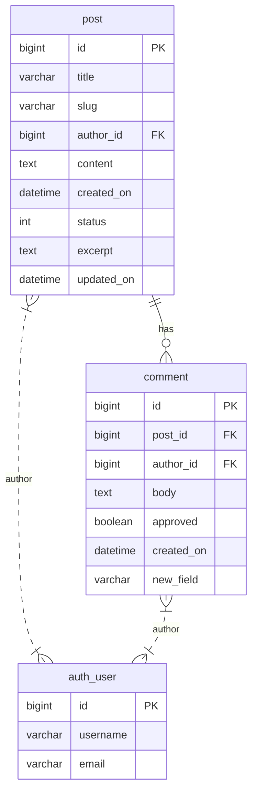

# Entity Relationship Diagram (ERD)

Below is a Mermaid ERD representing the current blog data model.

```mermaid
erDiagram
    post {
        bigint id PK
        varchar title
        varchar slug
        bigint author_id FK
        text content
        datetime created_on
        int status
        text excerpt
        datetime updated_on
    }

    comment {
        bigint id PK
        bigint post_id FK
        bigint author_id FK
        text body
        boolean approved
        datetime created_on
        varchar new_field
    }

    auth_user {
        bigint id PK
        varchar username
        varchar email
    }

    post ||--o{ comment : "has"
    post }|..|{ auth_user : "author"
    comment }|..|{ auth_user : "author"
```
